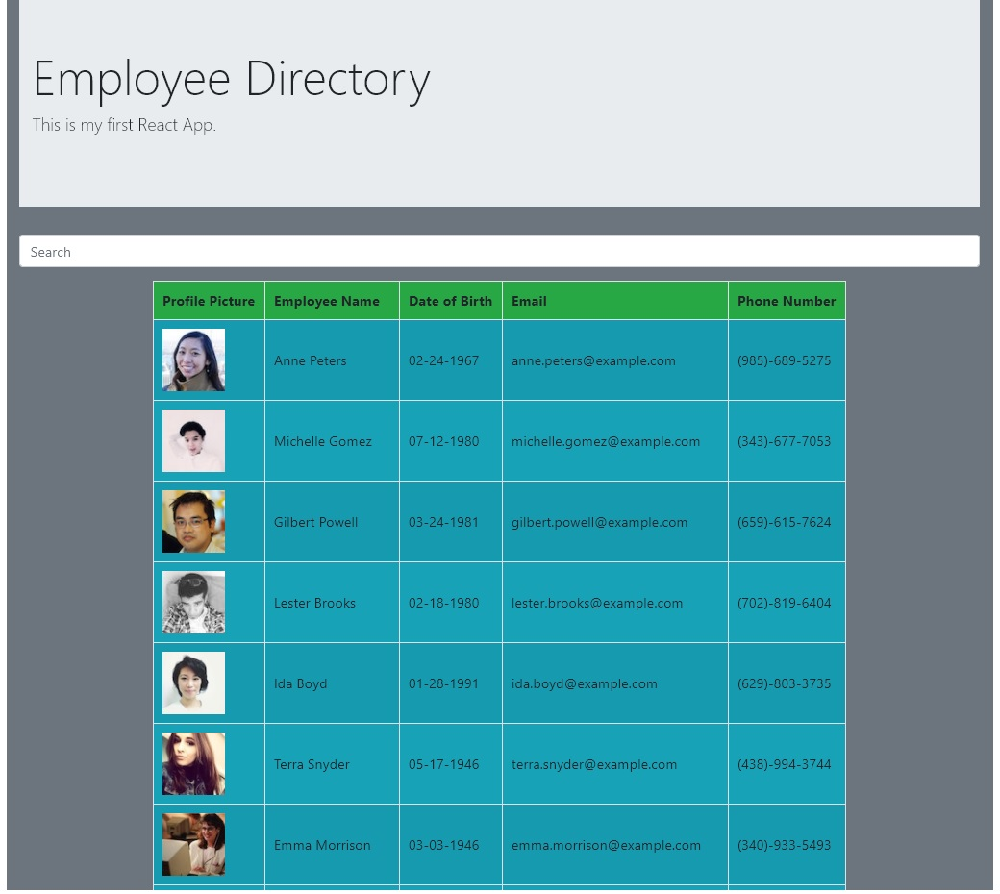

# React-Employee-Directory

## Description: 
This project is my first React App. It uses hooks like useEffect and setState. It also uses a an API to call data on random employees. The user can use the search bar to filter through the random employee list instantantaeously. Instead of an onSubmit, this app uses an onChange. When the query changes, a searchFilter function is called, using Javascript logic to filter through the Array of random Employees and re-render them with the React Component.

## Questions
Visit my Github page [jacobhoss](https://github.com/jacobhoss)
For any questions, please contact me at jacobhenryhoss2@gmail.com 

## Visit the Deployed App!

[Deployed App on GitHub](https://JacobHoss.github.io/React-Employee-Directory/)
